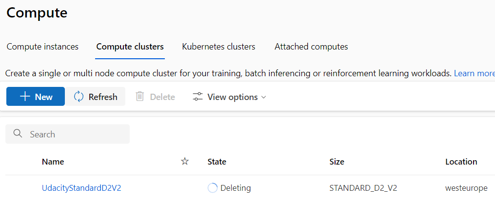

# Optimizing an ML Pipeline in Azure

## Overview
This project is part of the Udacity Azure ML Nanodegree.
In this project, we build and optimize an Azure ML pipeline using the Python SDK and a provided Scikit-learn model.
This model is then compared to an Azure AutoML run.

## Useful Resources
- [ScriptRunConfig Class](https://docs.microsoft.com/en-us/python/api/azureml-core/azureml.core.scriptrunconfig?view=azure-ml-py)
- [Configure and submit training runs](https://docs.microsoft.com/en-us/azure/machine-learning/how-to-set-up-training-targets)
- [HyperDriveConfig Class](https://docs.microsoft.com/en-us/python/api/azureml-train-core/azureml.train.hyperdrive.hyperdriveconfig?view=azure-ml-py)
- [How to tune hyperparamters](https://docs.microsoft.com/en-us/azure/machine-learning/how-to-tune-hyperparameters)

## Summary
**On a binary classification task, the project aims to optimize an ML pipline via tuning logistic regression model and compare it against Azure AutoML approach.**

**Though both approaches resulted in good performance, AutoML run resulted in better accuracy.**

## Scikit-learn Pipeline
**Explain the pipeline architecture, including data, hyperparameter tuning, and classification algorithm.**

**The pipeline architecture consists of the following in order:**
 * Instantiation of workspace from config
 * Creating compute cluster of _vm_size = Standard_D2_v2_ and _max_nodes=4_ using **ComputeTarget** and **AmlCompute** functions.
 * Creating environment from conda specifications
 * A training script (_train.py_) that takes hyperparameter input, loads data from URL as Tabular Dataset, process the data (eg, removing Nan, converting categorical string columns to numerical type), split train and test data, train logistic regression model for classification task, and log the metrics.
 * Define parameter sampling and terminal policy
 * Define a _ScriptRunConfig_ that access the previous train script, compute cluster and environment
 * Define a _HyperDriveConfig_, which orchestrates the hyperparameter tuning. This function takes the previous run config, train script, policy, sampler and other arguments to parallely explore different hyperparameter setting.
 * Finally, submit the above hyper drive config as an _Experiment_.

**I chose _RandomParameterSampling_ because, it can help find right hyperparameter quickly avoiding the computation cost of grid sampling. Also, the model performance is not significantly different to that of grid sampling.**

**The early termination policy chosen was _BanditPolicy_. This is used to better optimize computation resource when under budget constraints. In addition, this best suits for simpler binary classification tasks.**

## AutoML
**AutoML generated a voting ensemble algorithm for the best run. It comprised of XGBoost and Random Trees with different feature engineering techniques.**

## Pipeline comparison
**Compare the two models and their performance. What are the differences in accuracy? In architecture? If there was a difference, why do you think there was one?**

**In Scikit-learn pipeline the model was LogisticRegression, whereas in AutoML pipeline, the best model was a voting ensemble of gradient boosting and random tree classifier.** 
**The accuracy from AutoML is 0.916 which slightly better than scikit-learn pipeline's best run of 0.910.**
**AutoML has as added advantage of checking multiple algorithms with different hyperparameters, and as such AutoML has better chances at obtaining similar or better performance.**
**AutoML has built-in feature to show model interpretability and feature importance contrary to standard pipelines.**
## Future work
**For future work, the saved best model can be registered and deployed for inference with either batch or real-time endpoint.**
## Proof of cluster clean up

